# 01-需求分析和架构设计

## 需求

## 范围
### 普通用户使用的 H5 端（C 端）
- 使用者和用途：普通用户，也就是作品的受众，可以对作品分享。促进业务增长。
- 开发方式：H5 SSR

### 企业、作者使用的 B 端（B 端）
-   使用者和用途：企业、H5 作品的作者可以在此产出自己的海报作品，创建、编辑、发布作品
- 开发方式：前后端分离的方式由 editor-fe + editor-server 组成

### 平台管理员使用的管理系统（后台）
- 使用者和用途：平台管理员使用的后台管理系统，可以对作品进行管理，如用户管理，模板管理，作品管理以及数据统计
（统计也会用到第三方，比如百度统计）
- 开发方式：前后端分离方式，由 admin-fe + admin-server 组成

## 模块设计
### 模块拆分和关系图


### 特殊模块说明
- 编辑器为独立的组件库，同时用于编辑器和 h5
- 自研统计服务，因为埋点比较复杂，市面上没有合适的，或者有，但是很贵

## 数据结构
### 数据结构思路
- 尽量符合 vnode 规范
- 用数组来组织数据，可以保证有序
- 尽量使用引用关系，不要冗余

### 数据结构示例
```javascript
{
  "title": "",
  "setting": {}, // 一些可能的配置项，扩展性保证
  "props": {}, // 页面的一些设置，保证扩展性
  "components": [
    {
      "id": "xxx",
      "name": "文本1",
      "tag": "text",
      "attrs": {},
      "children": [],
    },
  ],
  "activeComponentId": "",
}
```
### 数据关系流转


## 扩展性保证
（引导架构设计会的与会人员讨论，集思广益）
- 扩展能选择的组件，数据结构层面的扩展
- 扩展编辑器的功能，例如：组件隐藏、锁定
- 扩展页面的配置，如多语言

## 开发提效
- 脚手架：创建、发布
- 组件平台：减少编写重复代码的时间，对于业务组件进行抽象，积累业务组件

## 运维保障
- 线上服务和运维服务
- 安全
- 监控和报警
- 服务扩展性：基于云服务，可以随时扩展机器的配置
- 发布回滚
